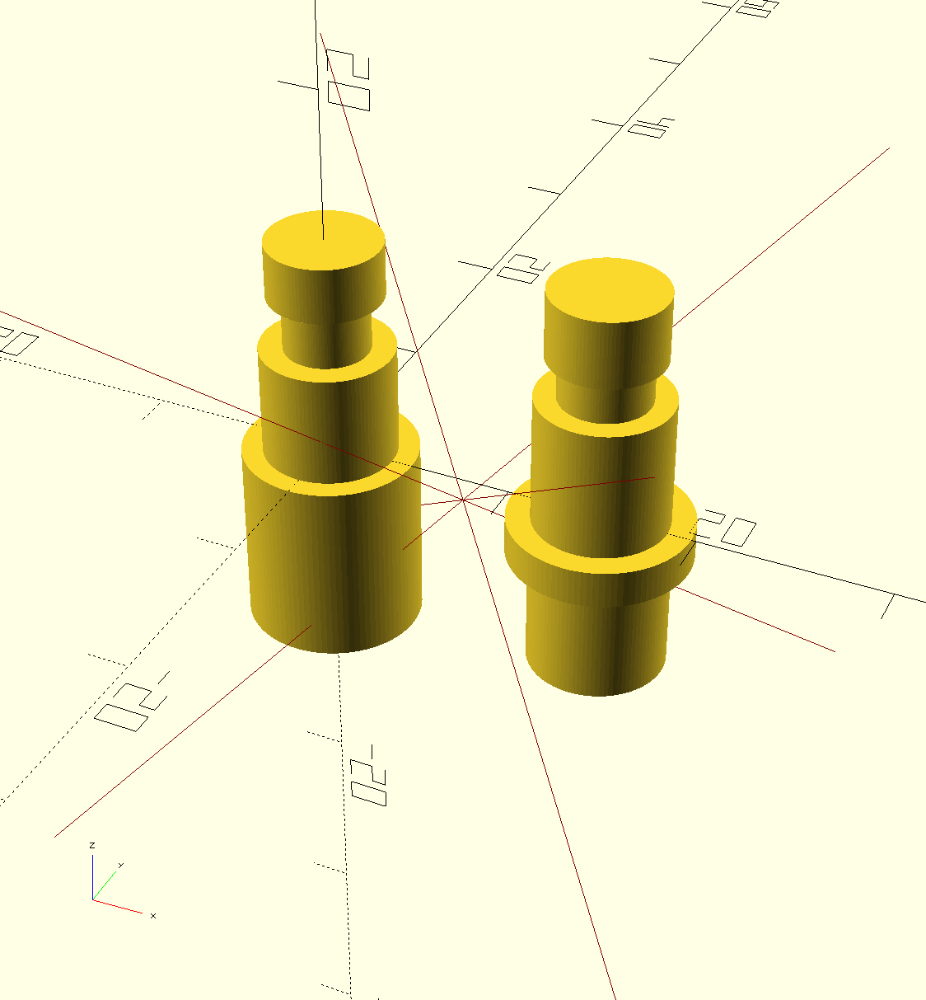

# push-switches
An OpenSCAD library to draw push switches.



## Installation
Add a git submodule to your project:

```sh
git submodule add https://github.com/mmalecki/openscad-push-switches push-switches
```

## Usage
```openscad
use <push-switches/push-switches.scad>;
ps10_push_switch();
```

## API

### `ps10_push_switch()`
Draws a [Ninigi PS10 push switch](https://www.tme.eu/Document/fd2548d568770839293d3f8a529c3622/ps10b.pdf).

### `pbs10_push_switch()`
Draws a [PBS10 push switch](https://elstat.pl/file/12538/12072.pdf).
